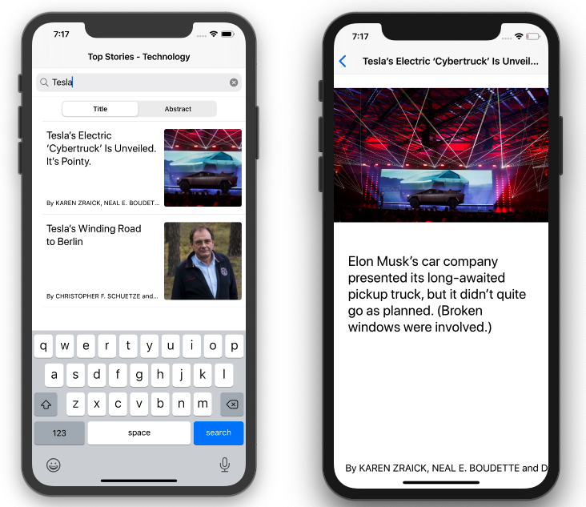
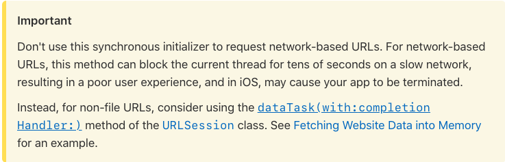

# TopStories

TopStories app uses local JSON that is read via the Bundle class and parses the contents into Swift objects using Codable and JSONDecoder()

#### Screenshots

## Apple Frameworks used 

1. [Foundation](https://developer.apple.com/documentation/foundation)
1. [UIKit](https://developer.apple.com/documentation/uikit)

## Apple APIs and classes used

1. [Bundle](https://developer.apple.com/documentation/foundation/bundle)   
1. [Data](https://developer.apple.com/documentation/foundation/data)  
1. [JSONDecoder](https://developer.apple.com/documentation/foundation/jsondecoder)  
1. [Codable](https://developer.apple.com/documentation/swift/codable)   
1. [URL](https://developer.apple.com/documentation/foundation/url)  
1. [URLSession](https://developer.apple.com/documentation/foundation/urlsession)  
1. [Result](https://developer.apple.com/documentation/swift/result) type 
1. Grand Central Dispatch (GCD) specifically [DisptachQueue](https://developer.apple.com/documentation/dispatch/dispatchqueue)  
1. [UITableView](https://developer.apple.com/documentation/uikit/uitableview), [UITableViewDataSource](https://developer.apple.com/documentation/uikit/uitableviewdatasource), [UITableViewDelegate](https://developer.apple.com/documentation/uikit/uitableviewdelegate) 
1. [UITableViewCell](https://developer.apple.com/documentation/uikit/uitableviewcell)
1. [UISearchBar](https://developer.apple.com/documentation/uikit/uisearchbar), [UISearchBarDelegate](https://developer.apple.com/documentation/uikit/uisearchbardelegate)
1. [UIImage](https://developer.apple.com/documentation/uikit/uiimage)

> Apple docs on not using Data(contentsOf:) to fetch urls from a network resource. Highly advises against doing this. In our TopStories app we are using the recommended dataTask method on URLSession. We strive to always adhere by the motherships' rules :rocket:

